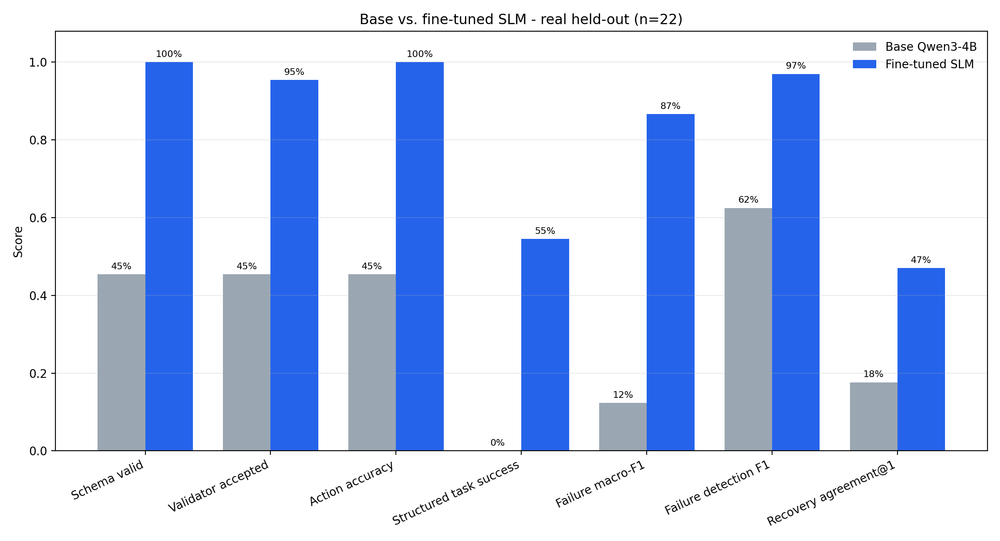
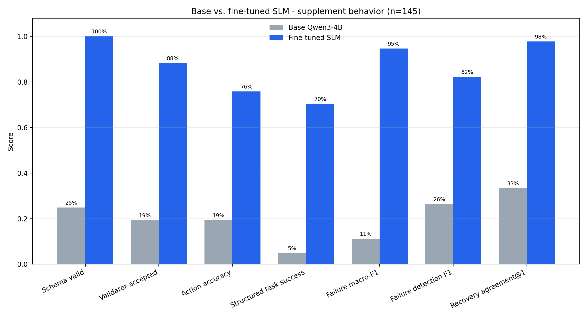

# SLM-only final results

This file is the main results entry point for the final SLM run. The complete reproducibility package is stored under [`runs/qwen3_robot_slm_20260916_001415`](runs/qwen3_robot_slm_20260916_001415/README.md).

## Run configuration

- Run: `qwen3_robot_slm_20260916_001415`
- Base model: `Qwen/Qwen3-4B`
- Base revision: `1cfa9a7208912126459214e8b04321603b3df60c`
- Training: QLoRA rank 8, 3 epochs, learning rate 5e-5, seed 42
- Hardware: NVIDIA A100-SXM4-40GB
- Best checkpoint: `checkpoint-204`
- Best evaluation loss: `0.0219620019`

## Primary real held-out evaluation

The real held-out evaluation contains 22 dialogue records. This is development evidence because participants represented in the broader project had already informed system development; it is not a new untouched publication test.

| Metric | Base Qwen3-4B | Fine-tuned SLM | Absolute change |
|---|---:|---:|---:|
| Schema-valid output | 45.5% | 100.0% | +54.5 pp |
| Validator acceptance | 45.5% | 95.5% | +50.0 pp |
| Action accuracy | 45.5% | 100.0% | +54.5 pp |
| Joint-goal accuracy | 0.0% | 100.0% | +100.0 pp |
| Structured task success | 0.0% | 54.5% | +54.5 pp |
| Failure macro-F1 | 0.123 | 0.867 | +0.744 |
| Failure-detection F1 | 0.625 | 0.970 | +0.345 |
| Recovery-strategy agreement@1 | 17.6% | 47.1% | +29.4 pp |
| Median generation latency | 6.11 s | 7.63 s | +1.53 s |
| P95 generation latency | 7.42 s | 9.36 s | +1.93 s |

The fine-tuned model produced valid JSON decisions on all 22 real held-out records and selected the correct action on all 22. The stricter structured-task success rate was 54.5% because it additionally requires the scored labels and grounded fields to match the reference. Recovery-strategy agreement improved from 17.6% to 47.1%. These improvements came with 1.53 seconds of additional median generation latency.

## Separate supplemental behavior test

The 145-record behavior test is a separate supplement and must not be merged with the real held-out score.

| Metric | Base Qwen3-4B | Fine-tuned SLM | Absolute change |
|---|---:|---:|---:|
| Schema-valid output | 24.8% | 100.0% | +75.2 pp |
| Validator acceptance | 19.3% | 88.3% | +69.0 pp |
| Action accuracy | 19.3% | 75.9% | +56.6 pp |
| Structured task success | 4.8% | 70.3% | +65.5 pp |
| Failure macro-F1 | 0.111 | 0.947 | +0.836 |
| Failure-detection F1 | 0.263 | 0.822 | +0.559 |
| Recovery-strategy agreement@1 | 33.3% | 97.8% | +64.4 pp |
| Unsupported-ID proposal rate | 4.1% | 5.5% | +1.4 pp |

## Detailed artifacts

- [Paper-oriented metric table](runs/qwen3_robot_slm_20260916_001415/results/paper_metrics.csv)
- [Complete evaluation summary](runs/qwen3_robot_slm_20260916_001415/results/evaluation_summary.json)
- [Base real-test predictions](runs/qwen3_robot_slm_20260916_001415/results/baseline_real_predictions.json)
- [Fine-tuned real-test predictions](runs/qwen3_robot_slm_20260916_001415/results/fine_tuned_real_predictions.json)
- [Base supplemental predictions](runs/qwen3_robot_slm_20260916_001415/results/baseline_behavior_predictions.json)
- [Fine-tuned supplemental predictions](runs/qwen3_robot_slm_20260916_001415/results/fine_tuned_behavior_predictions.json)
- [Deployable model bundle](runs/qwen3_robot_slm_20260916_001415/model/README.md)
- [Best resumable checkpoint](runs/qwen3_robot_slm_20260916_001415/checkpoint/checkpoint-204)
- [SHA-256 artifact manifest](runs/qwen3_robot_slm_20260916_001415/MANIFEST.sha256)
- [Executed training notebook](notebooks/train_qwen3_slm.ipynb)

## Interpretation boundary

- These results evaluate the SLM decision component, not the complete FSM/SLM router or live participant study.
- The real held-out set is development evidence, not a newly collected untouched publication test.
- The development-review, synthetic-smoke, and supplemental-behavior results remain separate in the evaluation summary.
- The public Qwen3 base weights are not included. Loading the model requires the pinned base revision plus the published LoRA adapter.
- The validator remains an important deployment layer: acceptance was 95.5% on the real held-out set and 88.3% on the supplemental behavior test.
